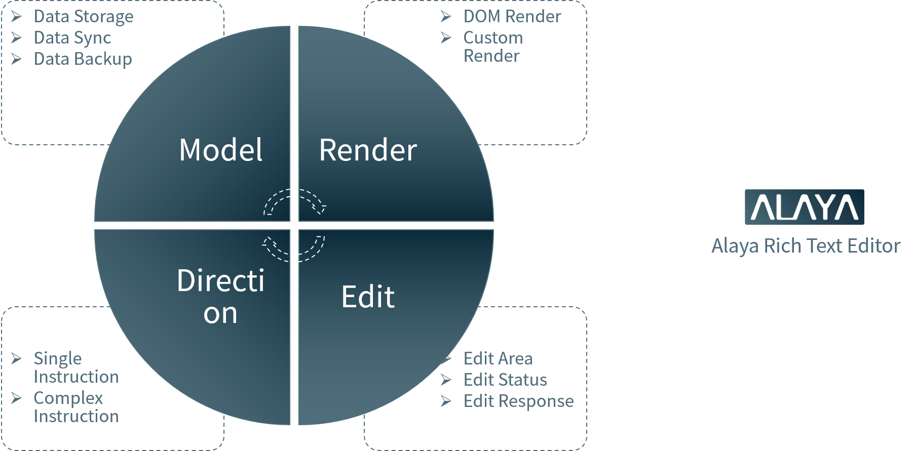
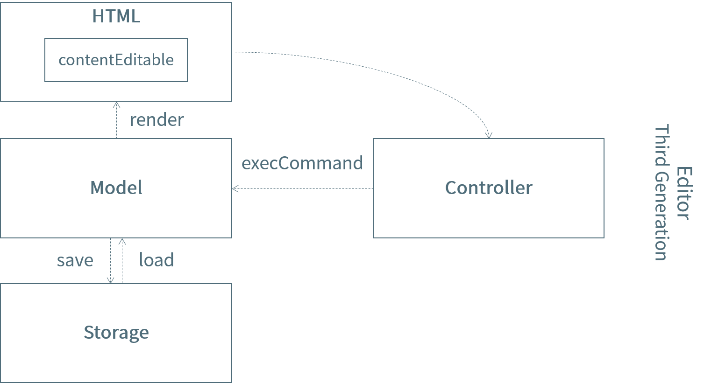

<p align="center">
  <a href="https://github.com/vleedesigntheory/alaya" title="Alaya"></a>
</p>

> [Alaya](https://github.com/vleedesigntheory/alaya) is a modern rich text editor.

## Quickstart

```js
npm install alaya
```

## Principle

The overall architecture design adopts the idea of hierarchical thinking with plug-in style. The whole module can be divided into four parts: Model, Render, Directive and Edit. Through the Alaya class, the overall rich text editor is exported.



[Alaya](https://github.com/vleedesigntheory/alaya) rich text editor draws on the technical implementation ideas of similar third-generation rich text editors such as [Quill](https://quilljs.com/), [Draft](https://draftjs.org/), and [Slate](https://www.slatejs.org/examples/richtext).



## License

[MIT](http://opensource.org/licenses/MIT)

Copyright (c) 2023-present VLeeDesignTheory
